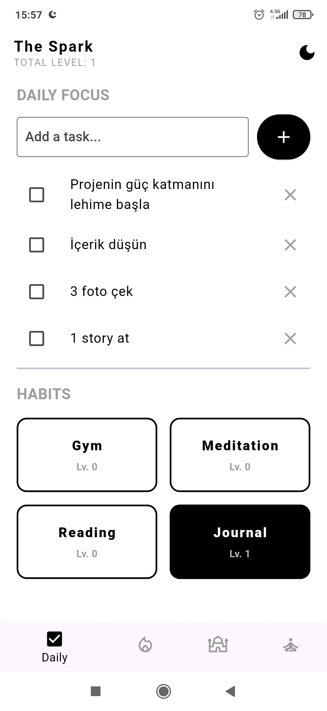
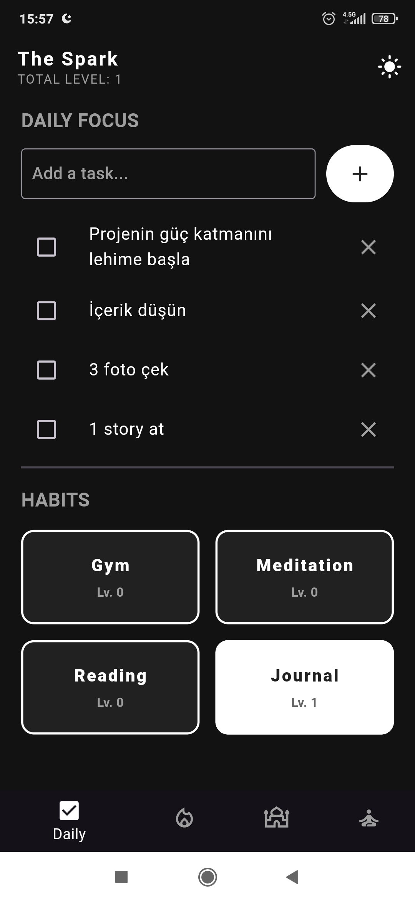
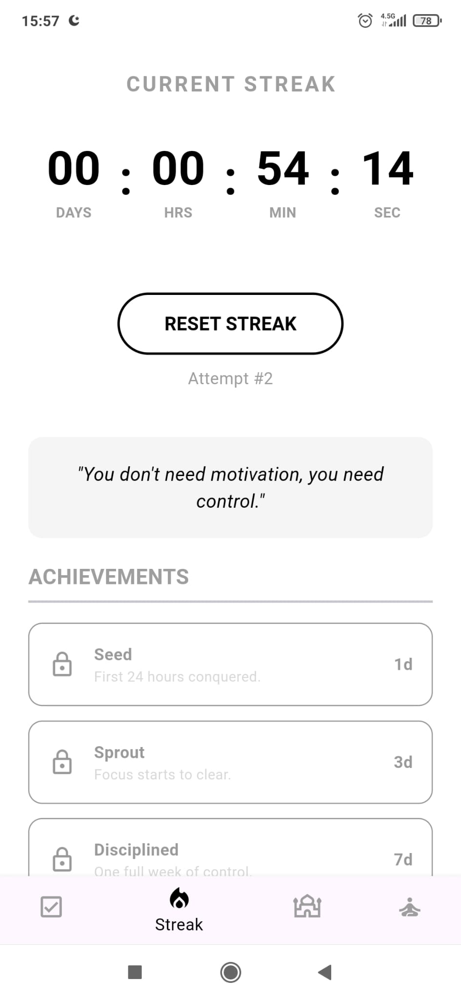
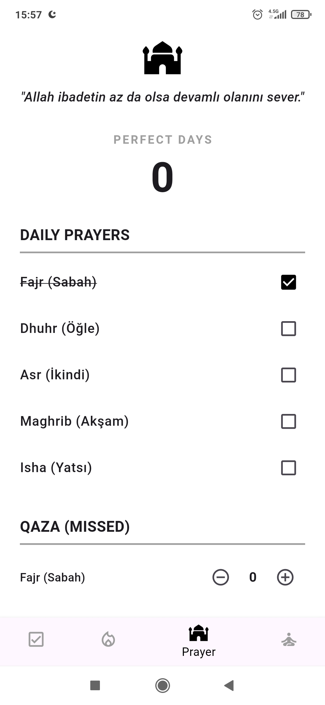
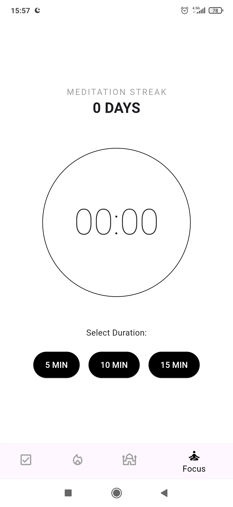

# 🧠 MindKernel

A minimal, distraction-free self-improvement system.

MindKernel is designed to help you build discipline, track your habits (and prayers), also stay consistent — without unnecessary complexity.

## 🚀 Features

- ✅ **Habit & To-Do Tracker**
  - Track daily tasks and 4 Main long-term habits
  - Simple and fast interface

- 🧘 **Meditation Timer**
  - Focus sessions
  - Build mental clarity and control

- 🔥 **Addiction Tracker**
  - Streak tracking
  - Urge awareness & self-control

- 🕌 **Namaz Counter**
  - Track daily prayers
  - Build consistency in worship

## 📱 Screenshots

| Light Mode | Dark Mode |
| :---: | :---: |
|  |  |

| Streak Tracker | Prayer & Qaza | Focus Timer |
| :---: | :---: | :---: |
|  |  |  |

## 🛠️ Tech Stack

- Flutter (UI)
- Firebase (optional backend) (working progress)
- Local storage for fast performance
- Gemini 3.1 Pro, vibecoding, and some imagination.

## Developer Note: 
This project is a product of "Vibe Coding". It was heavily co-created with Gemini as an experiment in rapid prototyping and building functional apps fast. The architecture might not be enterprise-grade (yet), but it works flawlessly for its purpose! PRs and refactoring tips are always welcome. 🚀
